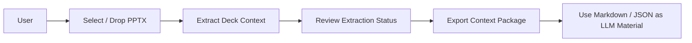
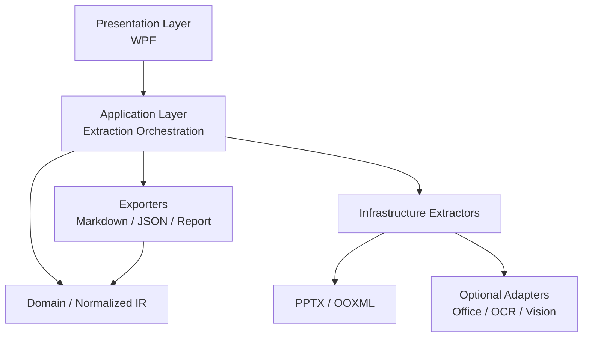
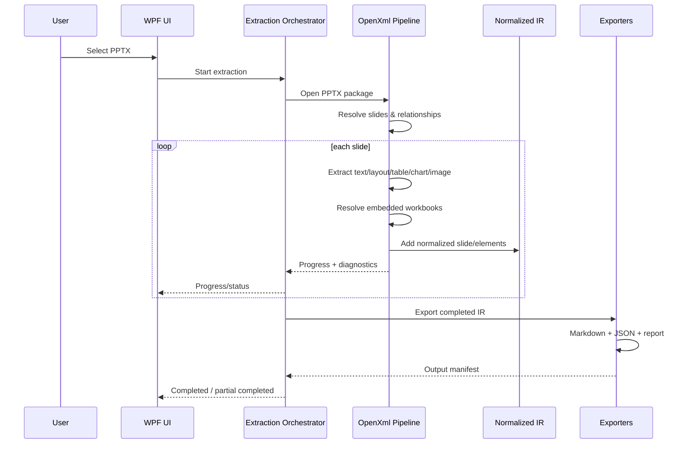
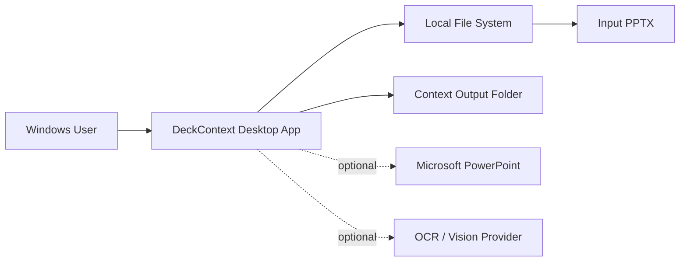

# DeckContext V1 软件架构设计（5 视图）

版本：0.1  
状态：Baseline  
仓库：`zhou-yang-personal/deck-context`

> 本文采用 4+1 View Model：场景视图（Use-case）作为“+1”，配合逻辑视图、开发视图、进程视图和部署视图描述 V1。本文只覆盖已经确认的 V1 需求及其实现所必需的架构能力，不引入知识库、账号、云同步、多人协作等未确认需求。

---

## 0. 架构结论

DeckContext V1 定义为 **Windows 本地桌面 PPT Context Extractor**。

核心不是“PPT 转 TXT”，而是建立一个统一的、可追溯的 **Normalized Intermediate Representation（IR）**，再从 IR 输出：

- `deck.context.md`：给人和 LLM 阅读；
- `deck.context.json`：给程序消费；
- `extraction-report.json`：记录完整性、异常和不支持对象；
- 必要的 `.xlsx` / CSV / media supporting assets。

核心流水线：

```text
PPTX
  -> OOXML Package / Relationship Reader
  -> Slide & Object Extractors
  -> Normalized IR
  -> Markdown / JSON Exporters
  -> Extraction Report
```

图片像素内容理解、PowerPoint 高保真渲染均作为 **Optional Adapter**，不得成为核心 OOXML 提取的必选依赖。

---

# 1. 场景视图（Use-case View / +1）

## 1.1 V1 唯一主场景

**把本地 PPT 历史材料转换成可以直接作为 LLM 素材使用的结构化 Context。**

用户的目标不是用 DeckContext 编辑 PPT，而是最大程度保留原 PPT 中对深度分析有用的信息：

- 文本；
- 组件位置和页面布局；
- 原生表格；
- 原生 Chart；
- Chart 背后的 Embedded Excel；
- 图片对象及可选图片语义；
- 数据与对象来源关系。

## 1.2 主用例



### UC-01 选择 PPTX

输入：本地 `.pptx`。  
输出：待解析任务。

### UC-02 执行解析

系统识别 PPT Package、Slides、Relationships，并按对象类型调用对应 Extractor。

### UC-03 解析数据对象

至少覆盖：

- Text；
- Geometry / layout；
- Native Table；
- Native Chart；
- Embedded Workbook；
- Image object/reference。

### UC-04 生成 Context

由同一份 IR 生成 Markdown 和 JSON，而不是分别读取 PPT 再各自输出。

### UC-05 查看异常

用户能够知道：

- 哪一页；
- 哪一个对象；
- 哪类信息；
- 是否完整提取；
- 未提取的原因。

### UC-06 导出

导出一个独立、可移动的 Context Package，用户可自行提供给 ChatGPT 或其他 LLM。

## 1.3 V1 不包含的场景

当前不设计：

- ChatGPT 登录/上传；
- 历史 PPT 搜索；
- 多文件知识库；
- 自动版本 Diff；
- PPT 修改回写；
- 在线协作；
- 云端素材库。

这些场景不能反向污染 V1 领域模型。

---

# 2. 逻辑视图（Logical View）

## 2.1 核心设计原则

逻辑架构分为五层：



**Domain / IR 是中心，OOXML 类型不能直接泄漏到所有 UI 和 Exporter。**

## 2.2 主要逻辑组件

### 2.2.1 `DeckContext.Application`

职责：

- 创建 extraction job；
- 驱动解析生命周期；
- 调度各 Extractor；
- 聚合 diagnostics；
- 构建/完成 IR；
- 调用 Exporter；
- 向 UI 提供进度和结果。

不负责解析具体 XML 节点。

### 2.2.2 `DeckContext.Domain`

职责：定义统一 IR 和业务无关的数据契约。

建议的核心模型：

```text
DeckContextDocument
├─ DeckMetadata
├─ Slides[]
│  └─ SlideContext
│     ├─ SlideMetadata
│     ├─ Elements[]
│     │  ├─ TextElement
│     │  ├─ TableElement
│     │  ├─ ChartElement
│     │  ├─ ImageElement
│     │  ├─ GroupElement
│     │  └─ UnknownElement
│     └─ Diagnostics[]
├─ Assets[]
└─ Diagnostics[]
```

通用 Element 信息至少包括：

```text
ElementIdentity
SourceReference
GeometryNative
GeometryNormalized
ZOrder
ParentGroup / Child relationship
ExtractionStatus
```

### 2.2.3 `DeckContext.OpenXml`

职责：读取 PPTX/OOXML 并将源对象映射为 IR。

内部可以按 Extractor 拆分：

```text
PackageReader
RelationshipResolver
SlideReader
TextExtractor
GeometryExtractor
TableExtractor
ChartExtractor
EmbeddedWorkbookExtractor
ImageExtractor
Theme/Style helper (only as needed)
```

其中：

- Open XML SDK 用于标准 OOXML 访问；
- 对 SDK 高层 API 无法完整提供的信息，允许直接读取 XML；
- 任何直接 XML 解析仍必须最终映射到统一 IR。

### 2.2.4 `DeckContext.Export`

职责：从 IR 生成稳定、确定性的输出。

```text
MarkdownExporter
JsonExporter
ExtractionReportExporter
SupportingAssetExporter
```

Exporter 不应重新解析 PPTX。

### 2.2.5 Optional Adapters

#### `DeckContext.OfficeInterop`

用途仅限需要本机 PowerPoint 的增强能力，例如高保真 Slide Export/Render。

约束：

- 不作为核心 Text/Table/Chart/Data 提取来源；
- PowerPoint 未安装时核心流程仍可完成；
- Office 异常不能破坏核心 extraction result。

#### `IImageTextProvider`

抽象图片像素内容理解。

可能实现方式未来可以是：

- local OCR；
- local multimodal model；
- external Vision API。

当前只定义接口边界，不选择强制 Provider。

## 2.3 Chart 逻辑模型

`ChartElement` 不仅保存可见文字，而应表达原生 Chart 结构：

```text
ChartElement
├─ ChartType
├─ Title
├─ Series[]
│  ├─ Name
│  ├─ Categories[]
│  ├─ Values[]
│  └─ SourceFormula / SourceRange
├─ Axes[]
├─ Legend
├─ DataLabels
├─ EmbeddedWorkbookReference
└─ ExtractionDiagnostics
```

原则：

> 可从 native chart / workbook 获取的数据，不通过截图 OCR 反推。

## 2.4 Embedded Excel 逻辑

Embedded Workbook 与 Chart 之间必须保存关系，而不是只输出一个孤立 XLSX：

```text
ChartElement
  -> WorkbookRelationship
  -> EmbeddedWorkbookAsset
  -> Worksheet
  -> Source Range / Cells
```

从而保证模型能够回答“图表中的数字来自哪里”。

## 2.5 Layout 表达

同时保存：

- native coordinates；
- normalized coordinates（例如 0~1）；
- object order/z-order；
- group relationship。

Markdown 层可以基于这些信息输出更适合 LLM 的区域/位置描述，但**推导结果与原始几何数据要分开**。

---

# 3. 开发视图（Development View）

## 3.1 技术栈

V1 baseline：

| Layer | Choice | Purpose |
|---|---|---|
| Runtime | .NET 10 LTS | Windows desktop runtime |
| Language | C# | 单一主语言，减少跨进程/跨语言复杂度 |
| Desktop UI | WPF | Windows 本地桌面 UI |
| PPTX / OOXML | Open XML SDK | Office Open XML package/object access |
| Deep OOXML access | System.Xml.Linq / XML APIs | 补齐高层 SDK 不足 |
| JSON | System.Text.Json | IR / report serialization |
| Office enhancement | PowerPoint Interop, optional | Optional rendering/export |
| OCR/Vision | Interface only in baseline | Provider later decided |

## 3.2 Solution 建议结构

实现阶段建议采用下面的逻辑拆分；具体物理项目数可在开始编码时根据依赖复杂度适度合并，但依赖方向不可反转。

```text
deck-context/
├─ AGENTS.md
├─ README.md
├─ docs/
│  ├─ requirements/
│  │  └─ v1-baseline.md
│  └─ architecture/
│     └─ 5-view-architecture-v0.1.md
├─ src/
│  ├─ DeckContext.App/
│  ├─ DeckContext.Application/
│  ├─ DeckContext.Domain/
│  ├─ DeckContext.OpenXml/
│  ├─ DeckContext.Export/
│  └─ DeckContext.Adapters/        # when an optional adapter is actually implemented
└─ tests/
   ├─ DeckContext.OpenXml.Tests/
   ├─ DeckContext.Export.Tests/
   └─ Fixtures/
```

> 当前 main 只基线文档，不因架构图存在上述目录就提前创建空代码工程。

## 3.3 依赖规则

推荐依赖方向：

```text
DeckContext.App
    -> DeckContext.Application

DeckContext.Application
    -> DeckContext.Domain
    -> extractor/export interfaces

DeckContext.OpenXml
    -> DeckContext.Domain
    -> Application contracts (if required)

DeckContext.Export
    -> DeckContext.Domain

Optional Adapters
    -> defined interfaces
```

禁止：

- Domain 引用 WPF；
- Domain 引用 PowerPoint Interop；
- Markdown Exporter 直接打开 PPTX；
- UI 直接操作 Open XML 节点；
- OpenXml parser 将 UI concern 写入 IR。

## 3.4 测试资产

测试应使用“小而明确”的 fixture PPTX，而不是只依赖大型真实客户材料。

Fixture 至少逐步覆盖：

```text
text-only.pptx
layout-basic.pptx
table-basic.pptx
chart-basic.pptx
chart-embedded-workbook.pptx
images-basic.pptx
groups-basic.pptx
unsupported-object.pptx
```

每次增加解析能力，应有能精确验证该能力的数据样本。

---

# 4. 进程视图（Process View）

## 4.1 单文件转换流程



## 4.2 并发策略

V1 不需要为了速度先引入复杂并行系统。

推荐：

- extraction job 在 UI 后台执行，不能阻塞 UI thread；
- slide/object 层面首先保证确定性和关系解析正确；
- Embedded Workbook 与 relationship resolution 必须考虑 Package 的线程安全边界；
- 在出现真实性能瓶颈之前，不以多线程并行解析为架构前提。

## 4.3 失败隔离

故障粒度：

```text
Deck
  -> Slide
      -> Object
          -> Sub-resource (chart/workbook/image)
```

默认策略：

- Package 完全损坏：任务失败；
- 单页关系损坏：该页 Partial/Failed，其他页继续；
- 单 Chart 不支持：记录 diagnostics，其他对象继续；
- OCR/Vision Adapter 失败：只影响 image semantics，不影响 OOXML extraction。

## 4.4 Extraction 状态

建议统一状态：

```text
NotStarted
Running
Succeeded
Partial
Failed
Unsupported
```

对象和任务都应能聚合出明确状态。

## 4.5 可观测性

用户需要的是“这份素材到底有没有被完整读出来”，因此 diagnostics 是产品能力而不是开发日志附属品。

结构至少包括：

```text
Severity
Code
Message
SlideIndex
ElementId / ElementName
Extractor
SourcePart / Relationship (when useful)
Result: skipped / partial / recovered
```

---

# 5. 部署视图（Deployment / Physical View）

## 5.1 V1 部署节点



核心路径完全在本机：

```text
Local PPTX -> Local DeckContext -> Local Context Package
```

## 5.2 发布形态

V1 推荐：

- Windows x64；
- self-contained deployment；
- 优先考虑便携/解压即用或简单 installer；
- 是否最终 single-file，在实现后根据 WPF/依赖/启动性能验证决定，不把 single-file 本身作为产品需求。

## 5.3 Office 依赖

### 核心功能

不要求 PowerPoint 安装。

### Optional Office Adapter

只有当用户开启/使用需要 PowerPoint 的增强能力时才检测：

- PowerPoint 是否安装；
- Interop 是否可创建实例；
- Export 是否成功。

失败时回落到核心 extraction，不能把整个任务判为失败。

## 5.4 OCR/Vision 部署边界

V1 baseline 不绑定具体 Provider，因此部署模型允许：

```text
No Provider
Local Provider
Remote Provider
```

Provider 必须显式配置/启用，且输出必须标记来源，不能把 AI 生成的图片描述冒充成 OOXML 原始信息。

## 5.5 数据与隐私边界

在核心模式下：

- PPTX 不需要上传服务器；
- Context 在本机生成；
- 不需要账号；
- 不需要数据库；
- 不需要网络。

如果未来启用 Remote Vision Provider，只有交给 Provider 的具体图片内容进入外部边界，届时必须单独设计隐私提示与配置；当前不提前实现。

---

# 6. 横切关注点

## 6.1 Traceability

每个高价值提取结果应尽量能追溯到：

```text
PPTX
 -> package part
 -> slide
 -> source object
 -> relationship
 -> workbook/range (if applicable)
```

这是 DeckContext 与普通 PPT-to-text 工具的关键差异。

## 6.2 Determinism

同一 PPTX、同一 DeckContext 版本、同一配置，应尽量生成结构稳定的 Markdown/JSON，便于：

- LLM 使用；
- 测试；
- 将来的 diff；
- 问题排查。

## 6.3 Fidelity vs. Semantic Description

必须明确区分两层：

### Source facts

例如：

- exact text；
- geometry；
- table cells；
- chart values；
- workbook ranges。

### Derived semantics

例如未来可能生成：

- “left 55% / right 45%”；
- “main evidence chart”；
- image caption；
- reading-order description。

Derived semantics 必须基于 source facts 或明确 Provider 输出，不得替代原始信息。

---

# 7. V1 首个实现阶段建议

当前架构基线完成后，代码实现应从 `dev` 开始，优先打通最小端到端链路，而不是先建设完整 UI。

建议实现顺序：

1. solution / Domain IR；
2. PPTX package + slide enumeration；
3. text + geometry；
4. native table；
5. native chart；
6. embedded workbook relationship/data；
7. Markdown/JSON exporter；
8. diagnostics；
9. minimal WPF conversion UI；
10. image object extraction；
11. 再决定 image pixel-content provider。

这只是实现顺序，不代表增加新的产品需求。

---

# 8. 架构验收条件

在进入“V1 核心架构已落地”的状态之前，至少需要用实际 PPTX fixture 证明：

- Text extraction 正确；
- Geometry/normalized layout 正确；
- Native Table 可恢复；
- Native Chart series/categories/values 可恢复；
- Embedded Workbook 的关系和相关数据可恢复；
- Image object 能识别且在无 Provider 时不会虚构描述；
- Markdown 与 JSON 来自同一 IR；
- 单对象失败可被诊断，不会无提示丢数据；
- 程序可在不安装 PowerPoint 的核心模式下运行。

编译成功不等于架构验收通过。

---

# 9. 尚未决策但已预留的唯一关键点

## 图片像素内容如何转文字

当前已确认需求中存在一个待选择实现策略的问题：PPT 中作为图片存在的套餐截图、地图、图表截图等，如果要让 LLM 在没有图片上传能力的情况下理解其内容，需要 Image-to-Text/Vision 能力。

架构已经通过 Provider 接口为其预留位置，但 **没有替用户决定**：

- 是不是 V1 第一阶段必须实现；
- 使用 OCR 还是 multimodal vision；
- 本地还是云端；
- 是否允许图片发送至外部 API。

在这个决策明确之前，核心解析器只负责可靠识别、提取和引用图片，不虚构图片内部语义。
